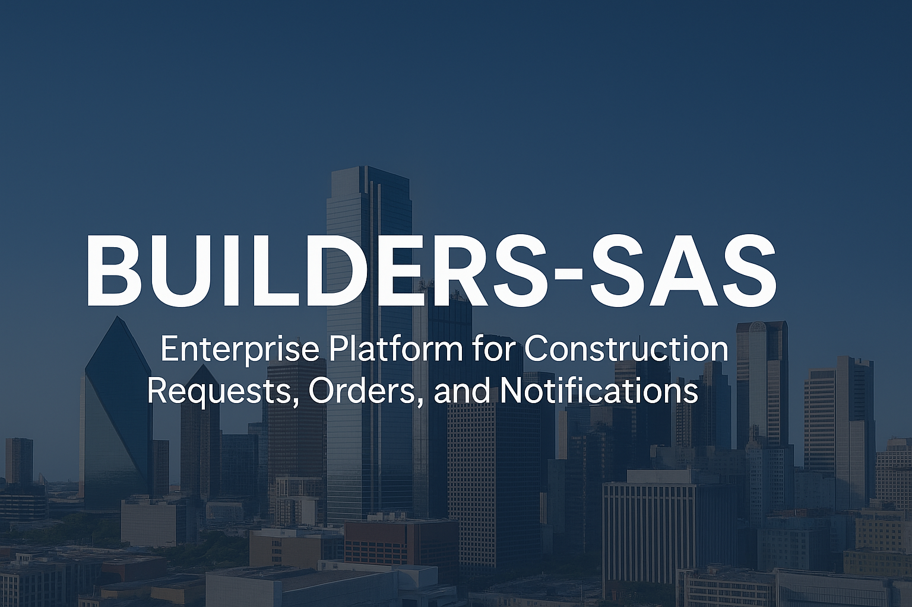
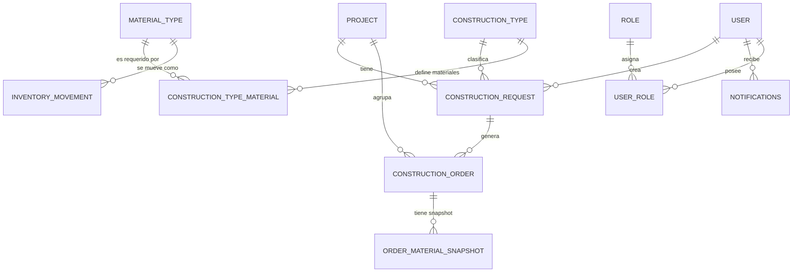
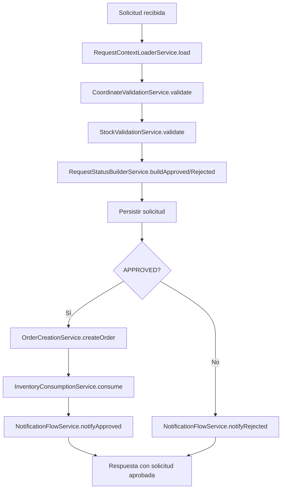
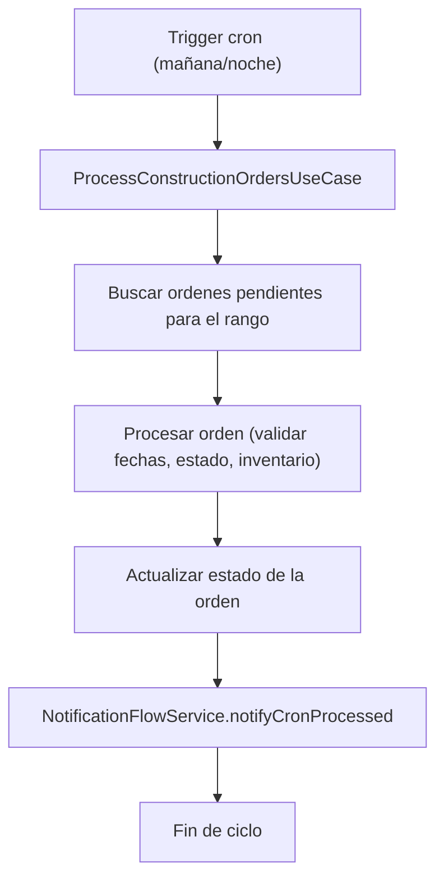
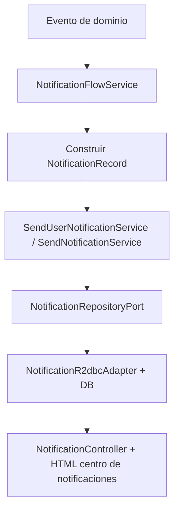

# BUILDERS-SAS ENTERPRISE



_Plataforma empresarial para la gestión de solicitudes de construcción, órdenes encadenadas, inventario y notificaciones en tiempo real, construida con Spring WebFlux y arquitectura hexagonal._

---

## Índice

1. [Visión general del proyecto](#visión-general-del-proyecto)
2. [Modelo de datos y diagrama entidad–relación](#modelo-de-datos-y-diagrama-entidadrelación)
3. [Arquitectura hexagonal](#arquitectura-hexagonal)
   1. [Capa de dominio](#capa-de-dominio)
   2. [Puertos de entrada (application in)](#puertos-de-entrada-application-in)
   3. [Casos de uso / aplicación](#casos-de-uso--aplicación)
   4. [Puertos de salida (application out)](#puertos-de-salida-application-out)
   5. [Infraestructura de persistencia (R2DBC)](#infraestructura-de-persistencia-r2dbc)
   6. [Infraestructura web (REST)](#infraestructura-web-rest)
   7. [Mappers entre capas](#mappers-entre-capas)
4. [Orquestador de solicitudes y creación de órdenes](#orquestador-de-solicitudes-y-creación-de-órdenes)
   1. [Flujo completo `ConstructionRequestOrchestratorService`](#flujo-completo-constructionrequestorchestratorservice)
   2. [Subservicios del orquestador](#subservicios-del-orquestador)
5. [Creación de órdenes desde solicitudes](#creación-de-órdenes-desde-solicitudes)
6. [Órdenes encadenadas y crons](#órdenes-encadenadas-y-crons)
   1. [Componentes del cron](#componentes-del-cron)
   2. [Diagrama de flujo de los crons](#diagrama-de-flujo-de-los-crons)
7. [Sistema de notificaciones](#sistema-de-notificaciones)
   1. [Componentes de notificación](#componentes-de-notificación)
   2. [Flujo de notificaciones por escenario](#flujo-de-notificaciones-por-escenario)
8. [Resumen de operadores y sentencias WebFlux/Reactor](#resumen-de-operadores-y-sentencias-webfluxreactor)
9. [Ejemplo de flujo completo: creación de solicitud y orden](#ejemplo-de-flujo-completo-creación-de-solicitud-y-orden)
10. [Guía rápida para nuevos desarrolladores](#guía-rápida-para-nuevos-desarrolladores)
11. [Repositorio y autores](#repositorio-y-autores)

---

## Visión general del proyecto

**BUILDERS-SAS ENTERPRISE** es una plataforma orientada a empresas constructoras que necesitan:

- Registrar **solicitudes de construcción** asociadas a proyectos y tipos de construcción.
- Validar **coordenadas** y **stock de materiales** antes de aprobar una solicitud.
- Generar **órdenes de construcción** encadenadas y registrar el consumo de inventario.
- Ejecutar **tareas programadas (crons)** que procesan órdenes automáticamente (jornada diurna y nocturna).
- Emitir **notificaciones** a usuarios específicos o globales (aprobaciones, rechazos, procesos automáticos, errores de validación).

La solución está construida sobre:

- **Java 17**
- **Spring WebFlux** + **R2DBC** (programación reactiva, no bloqueante)
- **Arquitectura hexagonal** (puertos y adaptadores)
- **Registros (`record`) inmutables** para el dominio

---

## Modelo de datos y diagrama entidad–relación

A nivel lógico, el modelo relacional se organiza en los siguientes grupos:

- **Proyectos y tipos de construcción**
  - `project`
  - `construction_type`
  - `construction_type_material` (materiales requeridos por tipo)
- **Materiales e inventario**
  - `material_type`
  - `inventory_movement` (entradas, salidas, consumo, daños)
  - `order_material_snapshot` (detalle inmutable de materiales de la orden)
- **Solicitudes y órdenes**
  - `construction_request`
  - `construction_order`
- **Seguridad y roles**
  - `user`
  - `role`
  - `user_role`
- **Notificaciones**
  - `notifications`

Diagrama conceptual (formato Mermaid, compatible con GitHub):



---

## Arquitectura hexagonal

La arquitectura hexagonal se organiza en capas claramente separadas.

### Capa de dominio

**Objetivo:** modelar el negocio de forma pura, sin dependencias de frameworks.

Componentes típicos:

- `ConstructionRequestRecord`, `ConstructionOrderRecord`, `ProjectRecord`, `ConstructionTypeRecord`, `NotificationRecord`, etc.

  - Tipo: **`record` de Java (inmutable)**.
  - Contienen solo datos y reglas de consistencia básicas (tipos, estados).

- Enumeraciones: `RequestStatus`, `OrderStatus`, `InventoryMovementType`, etc.
  - Tipo: **`enum`**.
  - Expresan estados de ciclo de vida y tipos de operación.

Ejemplo (simplificado):

```java
public record ConstructionRequestRecord(
        Long id,
        Long projectId,
        Long constructionTypeId,
        Double latitude,
        Double longitude,
        Long requestedByUserId,
        LocalDate requestDate,
        RequestStatus requestStatus,
        String observations,
        boolean active
) {}
```

### Puertos de entrada (application in)

**Objetivo:** definir qué operaciones puede ejecutar el mundo externo sobre el sistema.

Ejemplos típicos:

- `CreateConstructionRequestUseCase`
- `GetConstructionRequestsUseCase`
- `ProcessConstructionOrdersUseCase`
- `GetUserNotificationsUseCase`
- `SendNotificationUseCase`

Tipo: **`interface`**. No conocen detalles de infraestructura.

### Casos de uso / aplicación

**Objetivo:** implementar los puertos de entrada orquestando servicios, validaciones y puertos de salida.

Ejemplos:

- `ConstructionRequestOrchestratorService`
- `RequestOutcomeRouterService`
- `GetUserNotificationsService`
- `SendNotificationService`
- `SendUserNotificationService`

Tipo: **`@Service`** (clases de Spring) que:

- Reciben DTOs o records de dominio.
- Usan otros servicios de aplicación (coordenadas, stock, notificaciones).
- Usan puertos de salida para persistencia o mensajería.

### Puertos de salida (application out)

**Objetivo:** abstraer las dependencias externas (BD, notificaciones, etc.).

Ejemplos:

- `ConstructionRequestRepositoryPort`
- `ConstructionOrderRepositoryPort`
- `InventoryMovementRepositoryPort`
- `NotificationRepositoryPort`

Tipo: **`interface`**.  
Se implementan en la capa de infraestructura por adaptadores específicos (R2DBC, memoria, etc.).

Ejemplo simplificado de `NotificationRepositoryPort`:

```java
public interface NotificationRepositoryPort {

    Mono<Void> storeGlobal(NotificationRecord notification);

    Mono<Void> storeForUser(NotificationRecord notification, Long userId);

    Flux<NotificationRecord> getAllGlobal();

    Flux<NotificationRecord> getByUser(Long userId);

    Mono<Void> markAsRead(Long id);
}
```

### Infraestructura de persistencia (R2DBC)

**Objetivo:** implementar los puertos de salida contra PostgreSQL de forma reactiva.

Componentes:

- **Entities** (`NotificationEntity`, `ConstructionRequestEntity`, etc.)

  - Tipo: **clases anotadas con `@Table` y `@Column`**.
  - Representan filas de tablas.

- **Repositories** (`NotificationR2dbcRepository`, etc.)

  - Tipo: **`interface` que extiende `ReactiveCrudRepository`**.
  - Declaran métodos como `findByUserId(Long userId)`.

- **Adapters** (`NotificationR2dbcAdapter`, etc.)
  - Tipo: **clases `@Component`** que:
    - Reciben entities del repository.
    - Las convierten a records de dominio.
    - Implementan los métodos del puerto de salida.

### Infraestructura web (REST)

**Objetivo:** exponer la API HTTP reactiva.

Componentes:

- **Controllers** (`ConstructionRequestController`, `NotificationController`, etc.)

  - Tipo: **`@RestController`**.
  - Reciben/retornan DTOs, y delegan en casos de uso.

- **DTOs** (`ConstructionRequestCreateDto`, `ConstructionRequestResponseDto`, `NotificationDto`, etc.)

  - Tipo: `record` o `class` con anotaciones de validación (`@NotNull`, etc.).

- **Manejadores de error** (`GlobalExceptionHandler`)
  - Traducen excepciones de dominio a respuestas HTTP coherentes.

### Mappers entre capas

Hay dos familias principales de _mappers_:

1. **WebMappers** (por ejemplo `ConstructionRequestWebMapper`)

   - Capa: infraestructura web.
   - Transforman: **DTO ⇄ Record de dominio**.
   - Ejemplo: crear `ConstructionRequestRecord` desde `ConstructionRequestCreateDto`.

2. **PersistenceMappers** o mapeo directo en adapters
   - Capa: infraestructura de persistencia.
   - Transforman: **Entity ⇄ Record de dominio**.
   - Ejemplo: crear `NotificationRecord` desde `NotificationEntity` en el `NotificationR2dbcAdapter`.

Estos mappers permiten que el dominio se mantenga limpio, sin depender de anotaciones ni detalles de transporte.

---

## Orquestador de solicitudes y creación de órdenes

### Flujo completo `ConstructionRequestOrchestratorService`

El orquestador reactivo encadena todo el proceso de una solicitud:

```java
public Mono<ConstructionRequestRecord> create(ConstructionRequestRecord cmd) {

    return contextLoader.load(cmd)
        .flatMap(ctx ->
            coordinateValidation.validate(cmd.latitude(), cmd.longitude())
                .flatMap(coordinatesOK ->
                    stockValidation.validate(ctx.type().id())
                        .map(stockSummary ->
                            new ValidationBundle(coordinatesOK, stockSummary)
                        )
                )
                .map(bundle ->
                    new PipelineData(
                        cmd,
                        ctx,
                        bundle.coordinatesOK(),
                        bundle.stockSummary()
                    )
                )
        )
        .flatMap(this::buildStatus)
        .flatMap(this::persistRequest)
        .flatMap(this::routeOutcome);
}
```

En términos funcionales:

1. **Carga de contexto** (`RequestContextLoaderService`): proyecto, tipo, usuario, rol.
2. **Validación de coordenadas** (`CoordinateValidationService`).
3. **Validación de stock** (`StockValidationService`).
4. **Construcción de estado** (`RequestStatusBuilderService` → `APPROVED` o `REJECTED`).
5. **Persistencia de la solicitud** (`ConstructionRequestRepositoryPort`).
6. **Enrutamiento de resultado** (`RequestOutcomeRouterService`):
   - Si se aprueba → crear orden + consumir inventario + notificar.
   - Si se rechaza → notificar motivo de rechazo.

### Subservicios del orquestador

- **`RequestContextLoaderService`**

  - Tipo: `@Service`.
  - Capa: aplicación.
  - Consulta repositorios de proyecto, tipo de construcción, usuario y rol.
  - Devuelve `LoadedContext` (record con `ProjectRecord`, `ConstructionTypeRecord`, `UserRecord`, `RoleRecord`).

- **`CoordinateValidationService`**

  - Valida que las coordenadas no estén ocupadas por otra construcción.
  - Devuelve `Mono<Boolean>`.

- **`StockValidationService`**

  - Calcula si existe stock suficiente para cada material requerido por el tipo de construcción.
  - Devuelve `StockSummary` con detalle por material (`required`, `available`, `ok`).

- **`RequestStatusBuilderService`**

  - No accede a BD.
  - Construye un nuevo `ConstructionRequestRecord` con:
    - Estado `APPROVED` o `REJECTED`.
    - Observaciones generadas a partir del contexto y el stock.

- **`OrderCreationService`**

  - Crea `ConstructionOrderRecord` a partir de una solicitud aprobada.
  - Genera código de orden, fechas y estado inicial.

- **`InventoryConsumptionService`**

  - Registra movimientos de inventario tipo “consumo” para la orden creada.
  - Utiliza `InventoryMovementRepositoryPort` y snapshots de materiales.

- **`RequestOutcomeRouterService`**
  - Decide si ejecutar flujo aprobado o rechazado.
  - Encadena persistencia final, creación de orden, consumo y notificaciones.

Diagrama de flujo simplificado del orquestador:



---

## Creación de órdenes desde solicitudes

Condiciones clave para que se cree una orden:

1. El proyecto y el tipo de construcción existen.
2. El usuario solicitante existe y tiene un rol autorizado.
3. Las coordenadas no están ocupadas.
4. El stock es suficiente para todos los materiales requeridos.

Cuando estas condiciones se cumplen:

1. La solicitud pasa a estado **APPROVED**.
2. Se invoca `OrderCreationService.createOrder`, que:

   - Genera un código único para la orden.
   - Asocia la orden al proyecto, tipo y solicitud original.
   - Define fechas de inicio / fin planificadas.

3. `InventoryConsumptionService.consume` crea movimientos de inventario y snapshots de materiales.
4. `NotificationFlowService.notifyApproved` envía una notificación al usuario solicitante con el identificador de la orden creada.

Si alguna validación falla, la solicitud se marca como **REJECTED** y se notifica el detalle de las razones.

---

## Órdenes encadenadas y crons

### Componentes del cron

A nivel lógico intervienen:

- **Caso de uso** `ProcessConstructionOrdersUseCase`

  - Métodos:
    - `Mono<Void> processMorningOrders()`
    - `Mono<Void> processNightOrders()`

- **Scheduler de infraestructura**

  - Componente que programa la ejecución periódica (por ejemplo, cada mañana y cada noche) y delega en el caso de uso.

- **Servicios de dominio de órdenes**
  - Actualizan estados de la orden (en progreso, completada, vencida).
  - Generan movimientos adicionales de inventario si aplica.
  - Invocan `NotificationFlowService.notifyCronProcessed` para informar al usuario.

### Diagrama de flujo de los crons



---

## Sistema de notificaciones

### Componentes de notificación

- **Dominio**

  - `NotificationRecord` (record): id, userId, eventType, payload, read, createdAt.

- **Puertos**

  - `NotificationRepositoryPort`: operaciones de almacenamiento, consulta y marcado como leída.

- **Infraestructura**

  - `NotificationEntity` + `NotificationR2dbcRepository` + `NotificationR2dbcAdapter`
    - Implementan persistencia reactiva sobre la tabla `notifications`.

- **Casos de uso**

  - `SendNotificationService`: notificaciones globales.
  - `SendUserNotificationService`: notificaciones dirigidas a un usuario.
  - `GetUserNotificationsService`: obtiene notificaciones de un usuario.

- **Flujo de dominio**

  - `NotificationFlowService`: coordina el envío de notificaciones para:
    - Solicitudes rechazadas.
    - Solicitudes aprobadas y creación de orden.
    - Procesos automáticos del cron sobre órdenes.

- **Presentación**
  - `NotificationController` (`/api/v1/notifications/{userId}`): expone las notificaciones al frontend.
  - HTML del centro de notificaciones que consulta periódicamente la API y pinta badges, listas y estados leídos/no leídos.

### Flujo de notificaciones por escenario

#### 1. Solicitud rechazada

1. `RequestOutcomeRouterService` detecta resultado **REJECTED**.
2. Se persiste la solicitud rechazada.
3. Se invoca `NotificationFlowService.notifyRejected(req)`.
4. Este construye un `NotificationRecord` con:
   - `eventType = CONSTRUCTION_REQUEST_REJECTED`
   - `payload` = observaciones generadas por `RequestStatusBuilderService`.
5. `SendUserNotificationService.sendToUser` almacena el registro en `notifications`.

#### 2. Solicitud aprobada + creación de orden

1. Flujo aprobado del orquestador.
2. Se crea orden y se consume inventario.
3. `NotificationFlowService.notifyApproved(req, order)` genera mensaje:
   - “Solicitud X aprobada. Orden Y creada.”
4. Se almacena la notificación para el usuario solicitante.

#### 3. Procesamiento automático por cron

1. El cron invoca `ProcessConstructionOrdersUseCase`.
2. Cada orden procesada dispara `NotificationFlowService.notifyCronProcessed(order)`.
3. Se genera un mensaje como:
   - “Orden N procesada automáticamente por el cron nocturno.”

Diagrama simplificado:



---

## Resumen de operadores y sentencias WebFlux/Reactor

Principales construcciones utilizadas en el proyecto:

- **`Mono<T>`**  
  Representa 0 o 1 elemento asíncrono. Usado para operaciones CRUD individuales, validaciones y orquestación.

- **`Flux<T>`**  
  Representa 0..N elementos asíncronos. Usado para listados (por ejemplo, notificaciones de un usuario).

- **`map`**  
  Transforma el valor **sin** disparar operaciones asíncronas adicionales.  
  Ejemplo: construir `PipelineData` o `NotificationRecord` a partir de otro objeto.

- **`flatMap`**  
  Encadena operaciones asíncronas; toma un valor y devuelve otro `Mono`/`Flux`.  
  Ejemplo: después de validar stock, persistir la solicitud o crear una orden.

- **`filter`**  
  Deja pasar el valor solo si cumple una condición; de lo contrario emite vacío.  
  Ejemplo: decidir si el flujo sigue por rama aprobada.

- **`switchIfEmpty`**  
  Define una rama alternativa cuando el publisher previo no emite valores.  
  Ejemplo: si la validación no pasa, construir flujo **REJECTED**.

- **`then`**  
  Ignora el resultado anterior y continúa con otro `Mono<Void>`; útil para “ejecutar y continuar”.  
  Ejemplo: marcar notificación como leída y luego terminar sin cuerpo.

- **`thenReturn`**  
  Similar a `then`, pero devuelve un valor específico al final.  
  Ejemplo: ejecutar notificación y devolver la solicitud original.

- **`doOnNext`, `doOnError` (cuando se usan)**  
  Permiten registrar logs o efectos laterales sin alterar el flujo principal.

A nivel de Spring WebFlux:

- **`@RestController`, `@RequestMapping`, `@GetMapping`, `@PostMapping`**  
  Definen endpoints HTTP reactivos.

- **`@Service`, `@Component`**  
  Declaran componentes de aplicación e infraestructura gestionados por Spring.

- **`ReactiveCrudRepository`**  
  Proporciona operaciones CRUD reactivas (`findById`, `findAll`, `save`, etc.).

---

## Ejemplo de flujo completo: creación de solicitud y orden

1. El frontend envía un `POST /api/v1/construction-requests` con la información de la solicitud.
2. El `ConstructionRequestController` convierte el DTO a `ConstructionRequestRecord` mediante un _WebMapper_.
3. El `ConstructionRequestOrchestratorService.create` ejecuta:
   - Carga de contexto del proyecto/tipo/usuario.
   - Validación de coordenadas.
   - Validación de stock.
   - Construcción de estado `APPROVED` o `REJECTED`.
   - Persistencia de la solicitud.
   - Enrutamiento de resultado (con o sin orden).
4. Si se aprueba:
   - Se crea `ConstructionOrderRecord`.
   - Se registran movimientos de inventario.
   - Se genera notificación de aprobación.
5. El controller devuelve al cliente la solicitud final con su estado y observaciones.

---

## Guía rápida para nuevos desarrolladores

1. **Revisar el dominio**

   - Empezar por los `record` en `com.builderssas.api.domain.model.*` para entender el negocio.

2. **Identificar los casos de uso**

   - Ver interfaces en `com.builderssas.api.domain.port.in.*` y sus implementaciones en `application.usecase`.

3. **Ubicar puertos de salida**

   - Revisar `com.builderssas.api.domain.port.out.*` para saber qué dependencias externas existen.

4. **Conocer la infraestructura**

   - Entities y repositories R2DBC en `infrastructure.persistence`.
   - Controllers, DTOs y mappers en `infrastructure.web`.

5. **Probar los flujos clave**
   - Crear una solicitud, aprobarla/rechazarla y verificar notificaciones.
   - Ejecutar los crons de órdenes y comprobar los estados y notificaciones resultantes.

---

## Repositorio y autores

- **Repositorio GitHub:**  
  [`https://github.com/hgarciaospina/builders-sas-api-reactive`](https://github.com/hgarciaospina/builders-sas-api-reactive)

- **Autores:**
  - Ingeniero de sistemas: **Henry García Ospina**
  - Ingeniero electrónico: **Luis Ramos**
